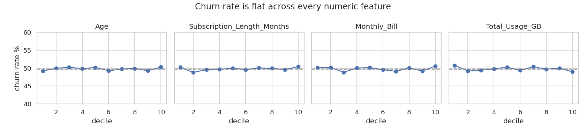

# Customer Churn: Testing Whether the Data Can Predict Churn

**Question:** can we predict which subscribers will churn from their age, gender, location, plan length, monthly bill and usage,
so that retention offers reach the right customers?

**Answer:** no. This dataset contains no usable churn signal. This repo shows how to establish that rigorously, instead of
shipping a model that only looks good on training data, and what data would be needed instead.



## Evidence (100,000 subscribers, 49.8% churned)

| Check | Result |
|---|---|
| Churn rate across deciles of age, plan length, bill, usage | stays between 48.8% and 50.8% for every feature |
| Chi-square test per feature | all p > 0.2 except location (p = 0.034), which doesn't survive a Bonferroni correction for six tests (threshold 0.0083) |
| Logistic regression, 5-fold CV | ROC-AUC **0.503** |
| LightGBM, 5-fold CV | ROC-AUC **0.505** |
| Same models with **shuffled** churn labels | ROC-AUC 0.500 on average, up to 0.505–0.507, so the real models are no better than chance |

## What went wrong in the first version

The original notebook (now in `archive/`) reported **99.98% training accuracy and 49% test accuracy** for a decision tree. That gap
is the classic sign of a model memorizing noise. The random forest and neural network also scored around 50%. The model was still
pickled and served through FastAPI + ngrok. Those deployment notebooks are kept in `archive/` as an example of the serving setup,
but the model shouldn't be used for decisions.

## What to collect instead

Churn is usually driven by changes in behavior and by friction, not by static demographics. Features worth collecting:
- usage trend (month-over-month change, not total usage)
- support tickets and complaints
- failed or late payments
- contract type and time until renewal
- plan downgrades and discount expiry

The notebook's checks (per-feature churn rates → cross-validated models → shuffled-label baseline) apply unchanged once those exist.

## Run it

```bash
pip install -r requirements.txt
# put customer_churn_large_dataset.xlsx in data/ (see data/README.md)
jupyter nbconvert --to notebook --execute churn_signal_check.ipynb   # ~1 min
```

## Files

```
churn_signal_check.ipynb     the analysis (executed, with outputs)
churn_signal_check.py        same notebook as a script (jupytext)
images/                      charts
data/README.md               where to get the dataset
archive/                     first version: EDA + models, FastAPI/ngrok deployment notebooks, pickled model
```

Tools: pandas, scikit-learn, LightGBM, scipy, matplotlib/seaborn.
